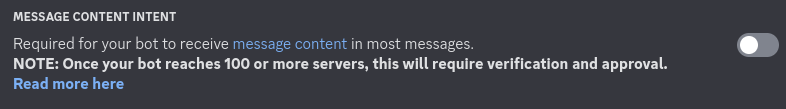
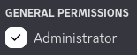

# Python Demo Bot
***DISCLAIMER:* This Guide has been written by the community**

How to create a Python Discord Bot with py-cord

> [!NOTE]
> This guide uses PyCharm.

## Installation

1. Download an IDE of your choice, preferably PyCharm you can download it [here](https://www.jetbrains.com/de-de/pycharm/download/).
1. Finish installing the programme to your pc and open it when you are done.

## Configuration

1. Make sure you have python set up on your device. If you don't, download it [here](https://www.python.org/downloads/).
1. Create a new project, set your base interpreter, if its not set, this should be the path to the .exe file of your installed python.
1. You can set a few more settings if you want like the location of your project
1. When you are done click create.

## Library set up

1. Go to the File in the left up corner and search for `Python Interpreter`
1. Add a dependency by clicking the + and searching for `py-cord`
1. Click "Install Package"
1. Wait for the packge to be installed and close the two pop up windows.

<!-- embed:start:DiscordAppCreation -->

## Create your Discord Bot

1. Open the [Discord Developer Portal](https://discord.com/developers/applications)
1. Click on  and enter any name you want for your bot and click .
1. Open the application and click on  on the left side of the screen.
1. Here you can change the username, profile picture, and banner of the bot.
1. On the same page, click on . The bot token will be shown to you. **Store the token somewhere safe, and don't share it with ANYONE!** It is needed for the bot to log-in.
1. For now, only the `Message Content Intent` is needed.

1. Now click on the  button on the left side. At the OAuth2 URL Generator, click on  and .
1. Just for testing, you can enable the bot permission `Administrator`. After testing, you should tighten the permissions to the needed ones.

1. At the bottom you will find the generated URL. Open it and invite the bot to your server to start using it.

<!-- embed:end:DiscordAppCreation -->

## Example Bot

1. Clear the main file you should see now. This will be used to register the bot.
1. Now add this code to the class.

```python
import discord

intents = discord.Intents.default()
# This sets the intents to the default intents of discord.
intents.message_content = True
# This allowes the bot to view the content of messages

bot = discord.Bot(intents=intents)
# Creates the bot with the intents

TOKEN = 'TOKEN'
# This sets the variable TOKEN with your token
```

3. Next we will create the events.

```python
import discord

intents = discord.Intents.default()
# This sets the intents to the default intents of discord.
intents.message_content = True
# This allowes the bot to view the content of messages

bot = discord.Bot(intents=intents)
# Creates the bot with the intents

TOKEN = 'TOKEN'
# This sets the variable TOKEN with your token


@bot.event
# This calls the event listener of py-cord to listen to the on_ready event and when its executed to run the code
async def on_ready():
    print(f'{bot.user} has connected to Discord!')
    # This will be printed when the Bot has successfully connected to Discord


@bot.event
# This calls the event listener of py-cord to listen to the on_message event and when its executed to run the code
# This is an old method. Please use slash-commands if you can.
async def on_message(message):
    if message.content == 'ping':
        # This is checking if the message equals  "ping"
        channel = message.channel
        # This gets the channel from discord and puts it into a variable
        await channel.send('pong!')
        # This is responding "pong" to the message


@bot.slash_command(name='ping', description='Ping!')
# This calls the slash command manager of py-cord to create a new command with the name ping and description "Ping!"
# and when the command is executed to run the code
async def ping(ctx):
    latency = bot.latency * 1000
    await ctx.respond(f"Latency: {latency:.2f} ms!")
    # This is responding with the latency of the bot, to the command


bot.run(TOKEN)
# This will start the Bot
```
<!-- panels:start -->
<!-- div:title-panel -->
## Final

<!-- div:right-panel -->
[Tutorial Video](https://www.youtube-nocookie.com/embed/ekyMHgiaWbE ':include :type=iframe width=80% height=200px')

<!-- div:left-panel -->
- In order to host your bot 24/7, you have to be registered at [Karlo-Hosting](https://karlo-hosting.com) and own a Python server.
- Upload the main.py file to the [Karlo-Hosting Panel](https://panel.karlo-hosting.com). Then create a file called "requirements.txt" and insert the required packages (here: py-cord). Under the startup tab of the server, you have to set the `bot py file` to `main.py`.
- If you need more information, go to the official [pycord guide](https://guide.pycord.dev) or the [pycord docs](https://docs.pycord.dev). You could also read the [advanced tutorial](/programm-your-bot/python/advanced.md). There you will learn more about commands and also about activities and the bot status.
- If you need help, go to the [Karlo-Hosting Discord server](https://discord.gg/xBPFF244eJ).

<!-- panels:end -->
